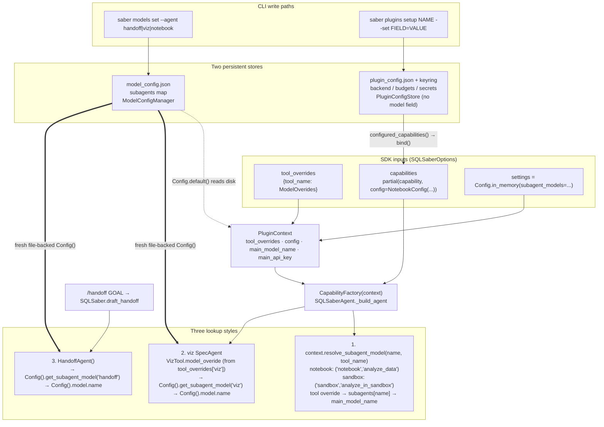

# How nested plugin models work

Synthesized by how explainer bc-af778c2c-9d75-5cc6-a515-92c94f74f54d against checkout `7344a75`.

## Overview

SQLsaber has two unrelated configuration stores that both touch plugins, and neither owns "which model does this plugin's nested agent use":

- `model_config.json` (`ModelConfigManager` in `src/sqlsaber/config/settings.py`) holds the main model, thinking, and a flat `subagents` map keyed by agent name. The CLI writes it via `saber models set --agent NAME`, where `NAME` is restricted to `AGENT_CHOICES = ("main", *SUBAGENT_KEYS)` and `SUBAGENT_KEYS = ("handoff", "viz", "notebook")`.
- `plugin_config.json` plus the OS keyring (`PluginConfigStore` in `src/sqlsaber/config/plugins.py`, added by PR #285) holds plugin-declared scalar settings. The CLI writes it via `saber plugins setup|set|unset`. No plugin declares a model field, and `Setting.kind` has no model kind.

At runtime, nested models are resolved in three different ways: notebook and sandbox go through `PluginContext.resolve_subagent_model`; viz's `SpecAgent` and the core `HandoffAgent` each build a fresh file-backed `Config()` and read `get_subagent_model("viz"|"handoff")` directly. The SDK's only documented override is `SQLSaberOptions.tool_overrides`, keyed by tool name (`"viz"`, `"analyze_data"`, `"analyze_in_sandbox"`), not agent name. Handoff is a core session verb (`/handoff` → `SQLSaber.draft_handoff`), not a capability, and shares the `subagents` table with plugins only by history.

## Key Concepts

- Agent name vs tool name. `SUBAGENT_KEYS` entries (`handoff`, `viz`, `notebook`) are agent names used in `model_config.json` and `--agent`. `tool_overrides` keys are model-visible tool names: viz's tool is also called `viz`, but notebook's is `analyze_data` and sandbox's is `analyze_in_sandbox`. `tool_overrides={"notebook": ...}` is silently ignored. Sandbox's agent name `"sandbox"` is not in `SUBAGENT_KEYS` at all.
- `PluginContext` (`src/sqlsaber/capabilities/plugins.py`). Frozen dataclass handed to every capability factory: `registry`, `knowledge_manager`, `tool_overrides`, `config`, `main_model_name`, `main_api_key`, stores, and `resolve_subagent_model(name, *, tool_name)`.
- Capability factory. A callable `(PluginContext) -> AbstractCapability | Sequence[...]`. Exported via the `sqlsaber.capabilities` entry-point group (CLI discovery) or passed directly in `SQLSaberOptions.capabilities` (SDK). `resolve_capability_specs` invokes factories once; exceptions are logged with `logger.warning`, not raised.
- `PluginSettings` / `Setting` (`src/sqlsaber/plugin_settings.py`). Side-effect-free declaration exported via `sqlsaber.plugin_settings`. `Setting.kind` is `text|integer|number|boolean|secret`, scalars only. `bind(values, secrets)` returns a capability factory; it runs before any `PluginContext` exists.
- `ModelOverides` (`src/sqlsaber/overrides.py`). `model_name` + optional `api_key`; `api_key` without `model_name` raises. Normalized by `normalize_tool_overides` in `SQLSaberAgent.__init__`.
- `Config.default()` vs `Config.in_memory()`. Default is file-backed and re-reads disk on every getter. `in_memory(subagent_models=...)` uses `InMemoryModelConfigManager`, whose constructor drops keys not in `SUBAGENT_KEYS` (tested in `tests/test_config/test_settings.py::test_in_memory_config_accepts_notebook_subagent`).

## How It Works

### Session assembly

CLI (`src/sqlsaber/cli/commands.py::_create_cli_saber`) calls `cli_sqlsaber_options(...)` from `src/sqlsaber/cli/session.py`, which fills `capabilities` from `configured_capabilities()`:

1. For each entry point in `sqlsaber.capabilities` (sorted by name), skip if `PluginConfigStore().get(name).enabled` is false.
2. If a `sqlsaber.plugin_settings` declaration exists: `resolve_settings(name, declaration, saved.settings)` (flag > env > saved > default, then `declaration.validate`), then `factory = declaration.bind(values, secrets)`. `PluginSetupRequired` with no saved settings is a warning and the plugin is skipped; with saved settings it raises.
3. Otherwise `factory = entry_point.load()` (viz path).
4. Wrap as `CapabilityFactory(name, factory)`.

The CLI passes no `model_name`, `api_key`, `settings`, or `tool_overrides`; everything model-related comes from `Config.default()` reading disk.

SDK (`src/sqlsaber/sdk/_runtime.py`) forwards `options.settings or Config.default()`, `options.model_name`, `options.api_key`, `options.tool_overrides`, and `options.capabilities` to `SQLSaberAgent`. No entry-point scan; `discover_capabilities` exists but is only used by tests.

`SQLSaberAgent._build_agent` (`src/sqlsaber/agents/pydantic_ai_agent.py`) resolves the main model, builds `PluginContext(tool_overrides=..., config=self.config, main_model_name=model_name, main_api_key=resolved.api_key, ...)`, and on first build runs `resolve_capability_specs(self._capability_specs, context)`. Builtins `Knowledge` and `SqlTools` are hardcoded; plugin capabilities are appended. On rebuild (`set_thinking`, `reload_model_settings`) factories are not re-run; instead `capability.update_context(context)` is called on each `SqlSaberCapability`. Notebook and sandbox implement it (swap `tool._context` / `tool.context`); viz inherits the no-op from `SqlSaberCapability`.

### The three lookup styles

1. `PluginContext.resolve_subagent_model(name, tool_name=)`, used by notebook (`AnalyzeDataTool._execute`, `("notebook", "analyze_data")`) and sandbox (`AnalyzeSandboxTool.execute_with_attachments`, `("sandbox", "analyze_in_sandbox")`) at tool-call time:
 - `model_name = tool_overrides[tool_name].model_name or config.model.get_subagent_model(name) or main_model_name`
 - `api_key = override.api_key or (main_api_key if override is None and subagent_model is None else None)`, then `resolve_model(config.auth, model_name, api_key_override=api_key)`. So any override, from either store, stops inheriting the main key and falls back to `config.auth` (keyring/env) for that provider.
2. Viz `SpecAgent` (`plugins/viz/src/sqlsaber_viz/spec_agent.py`). `Visualization.__init__` copies `context.tool_overrides.get("viz")` onto `VizTool.model_overide`; `VizTool.execute` constructs `SpecAgent(model_name=..., api_key=...)` per call. `SpecAgent.__init__` does `self.config = Config()` (fresh, file-backed) and resolves `override or Config().model.get_subagent_model("viz") or Config().model.name`. It ignores `PluginContext.config`, `main_model_name`, and `main_api_key`.
3. `HandoffAgent` (`src/sqlsaber/agents/handoff_agent.py`). Same shape as viz: `Config()` on construction, `ctor override or get_subagent_model("handoff") or Config().model.name`. `SQLSaber.draft_handoff` calls `HandoffAgent()` with no arguments, so the constructor override is dead in practice.

### Live reload

`/models set|reset` in the REPL (`src/sqlsaber/cli/slash_commands.py::_handle_management`) compares `model_config.json` mtime and calls `saber.reload_model_settings()` → `_build_agent()` → `update_context`. `/plugins ...` does not reload; `plugins setup` prints "Changes apply to new CLI sessions." Viz and handoff would pick up `model_config.json` changes anyway because they re-read disk per invocation.

### Handoff flow

`/handoff <goal>` → `SlashCommandProcessor._handle_handoff` returns `CommandResult(handoff_goal=...)` → `InteractiveSession._start_handoff` → `SQLSaber.draft_handoff(goal)` → `HandoffAgent().generate_draft(history, goal)` → draft placed in the editor → user submits → new thread. The main agent never sees a handoff tool; nothing runs inside `agent.run()`. Slash commands are a fixed catalog in `src/sqlsaber/cli/command_catalog.py`; there is no entry-point group for them.

## Where Things Live

- `src/sqlsaber/config/settings.py`: `SUBAGENT_KEYS`, `ModelConfigManager.{get,set}_subagent_model`, `InMemoryModelConfigManager` (filters to `SUBAGENT_KEYS`), `Config.default` / `Config.in_memory`.
- `src/sqlsaber/cli/models.py`: `AGENT_CHOICES`, `_normalize_agent`, `set|current|reset --agent`; `models current` without `--agent` tables exactly `SUBAGENT_KEYS`. `--thinking-level` is main-only.
- `src/sqlsaber/capabilities/plugins.py`: `PluginContext.resolve_subagent_model`, `CapabilityFactory`, `resolve_capability_specs`, `discover_capabilities` (test-only), `PLUGIN_GROUP = "sqlsaber.capabilities"`.
- `src/sqlsaber/capabilities/base.py`: `SqlSaberCapability.update_context` no-op default.
- `src/sqlsaber/agents/pydantic_ai_agent.py`: `SQLSaberAgent._build_agent`, `reload_model_settings`, builtins hardcoded.
- `src/sqlsaber/overrides.py`: `ModelOverides`, `normalize_tool_overides`.
- `src/sqlsaber/sdk/options.py`, `src/sqlsaber/sdk/_runtime.py`, `src/sqlsaber/sdk/client.py`: `SQLSaberOptions.{tool_overrides,capabilities,settings,model_name,api_key}`, `SQLSaber.draft_handoff`.
- `src/sqlsaber/plugin_settings.py`, `src/sqlsaber/config/plugins.py`, `src/sqlsaber/cli/plugins.py`, `src/sqlsaber/cli/session.py`: declaration types, store/resolution, `plugins` CLI, `configured_capabilities`.
- `src/sqlsaber/agents/handoff_agent.py`, `src/sqlsaber/cli/slash_commands.py`, `src/sqlsaber/cli/interactive.py`: handoff.
- `plugins/viz/src/sqlsaber_viz/{capability,tools,spec_agent}.py`; `plugins/viz/pyproject.toml` exposes only `sqlsaber.capabilities`.
- `plugins/notebook/src/sqlsaber_notebook/{capability,settings,config}.py`; `plugins/notebook/pyproject.toml` exposes `sqlsaber.capabilities`, `sqlsaber.display_tools`, `sqlsaber.plugin_settings`. `NotebookConfig` docstring: "workspace, execution, and export budgets, not model-preview budgets." Standalone `sqlsaber-notebook` CLI uses `--model` / `SQLSABER_NOTEBOOK_MODEL`.
- `plugins/sandbox/src/sqlsaber_sandbox/{capability,tools,settings,config,session}.py`; same three entry-point groups. `SandboxConfig` has no model field; `SandboxSession(model=..., model_provider=...)` is the direct API.
- Docs that currently teach `--agent viz|notebook`: `docs/src/content/docs/guides/models.mdx`, `guides/plugins.mdx`, `reference/commands.md`; SDK `tool_overrides` example with `"viz"` in `sdk/advanced.mdx`. Verify surfaces: `.agents/skills/verify-sqlsaber/features/{plugins,model-configuration}.md`, `scripts/verify_plugin_settings.py`.

## Gotchas

- `SUBAGENT_KEYS` is enforced in only three places: `_normalize_agent` (CLI), `InMemoryModelConfigManager.__init__`, and the `models current` table. The file-backed `ModelConfigManager.get_subagent_model` does not filter, so a hand-edited `subagents.sandbox` in `model_config.json` is honored by `resolve_subagent_model("sandbox", ...)` in CLI sessions yet is invisible in `models current` and unsettable via `--agent`.
- Viz and handoff ignore session state. `SQLSaberOptions.model_name`, `api_key`, and `settings=Config.in_memory(...)` never reach `SpecAgent` or `HandoffAgent`; both read whatever is on disk. `tool_overrides["viz"]` is the only SDK lever for viz; there is none for handoff.
- `update_context` is not `rebind`. Rebuilds refresh `PluginContext` for notebook/sandbox but cannot change bound `NotebookConfig`/`SandboxConfig`; viz's `model_overide` is fixed at construction.
- API-key inheritance flips off on any override. A `subagents.viz` entry pointing at the same provider as main still makes `resolve_subagent_model` drop `main_api_key` (and viz never had it), so an SDK caller who supplied `api_key` only via `SQLSaberOptions` gets a keyring/env lookup for the child.
- `plugin_settings` `bind` timing: `configured_capabilities()` runs `bind` before `SQLSaber`/`PluginContext` exist, so `bind` cannot call `resolve_subagent_model` or see the main model; it can only close over values.
- Sandbox shows "setup required" in `plugins list` because `provider` is `required=True`; unrelated to models.
- `plugins setup viz` fails with "exposes no settings"; viz has no declaration to add a field to.

## Implications for a move to `plugins setup`

What must stay:
- `saber models set --agent handoff` and the `subagents.handoff` key. Handoff is a core session verb with no capability, no enable/disable, no entry point; `SQLSaber.draft_handoff` must remain in core.
- `SQLSaberOptions.tool_overrides` keyed by tool name, or an explicit migration with a deprecation path; it is the documented SDK override (`sdk/advanced.mdx`, `sdk/configuration.mdx`).
- Reading existing `subagents.viz` / `subagents.notebook` from `model_config.json` for at least one release, since they exist in the wild.
- CLI startup time: any new model `Setting` must not import `pydantic_ai` or `sqlsaber.agents.model_factory` at declaration time; validation of `provider:model` syntax can use `sqlsaber.config.providers.canonical` as `cli/models.py` already does.

What is already the right owner:
- `PluginContext.resolve_subagent_model` is the correct single choke point; notebook and sandbox already use it. The fix is to make viz call it (and stop constructing `Config()`), not to add a fourth path.
- `plugin_config.json` + `PluginSettings.bind` is the CLI persistence and binding path for plugin-owned values; a `model` field with `kind="text"` (or a new `model` kind with provider validation) fits the existing `--set model=... --yes` and `plugins show` surfaces non-interactively.
- `SQLSaberOptions.capabilities` with `partial(capability, config=...)` is how SDK users configure plugins; adding an optional model (and api key) to `NotebookConfig`/`SandboxConfig`/a viz config object, and threading it into the lookup as the "config override" layer, keeps the SDK independent of the CLI store.

Traps:
- Tool name vs agent name. `SUBAGENT_KEYS` names (`viz`, `notebook`) and `tool_overrides` keys (`viz`, `analyze_data`, `analyze_in_sandbox`) only coincide for viz. Do not "fix" this by making `tool_overrides` accept agent names in core; that would be a second plugin-name list. If a plugin-declared model becomes the middle precedence layer, the precedence in `resolve_subagent_model` should become explicit: `tool_overrides[tool_name]` → plugin-bound config model → legacy `subagents[name]` (or drop) → `main_model_name`.
- Bind timing. `bind` returns the factory before `PluginContext` exists, so the model chosen in `plugins setup` must be baked into the config object (`NotebookConfig.model`, etc.) and consumed later at tool-call time, not resolved in `bind`. Do not make `bind` construct a `Model`.
- Viz `Config()` leak. If viz keeps `SpecAgent(Config())`, a `plugins setup viz --set model=...` value stored in `plugin_config.json` will not be read, and SDK `settings`/`model_name` will keep being ignored. Viz also needs a `sqlsaber.plugin_settings` entry point and an `update_context` implementation for the change to be coherent.
- Sandbox missing from `SUBAGENT_KEYS`. Do not add `sandbox` to `SUBAGENT_KEYS` as a stopgap; that grows the core plugin-name list PR #285 avoided. Conversely, remember the file-backed reader does not filter, so any compatibility shim that reads legacy `subagents.*` should decide explicitly whether unknown keys are honored.
- Handoff is not a plugin. Moving it under `plugins setup` would require a new "internal plugin" type, slash-command extension points, and an enable/disable story for a vanilla command. Keep `--agent handoff` and let `AGENT_CHOICES` shrink toward `("main", "handoff")` as plugin names migrate.
- Docs and verify surfaces. `guides/plugins.mdx`, `guides/models.mdx`, `reference/commands.md`, `.agents/skills/verify-sqlsaber/features/model-configuration.md` (`models-set-agent` lists viz and notebook), and `scripts/verify_plugin_settings.py` all encode the current `--agent viz|notebook` behavior and need updating in the same change.
